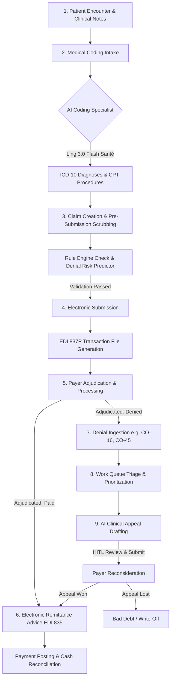
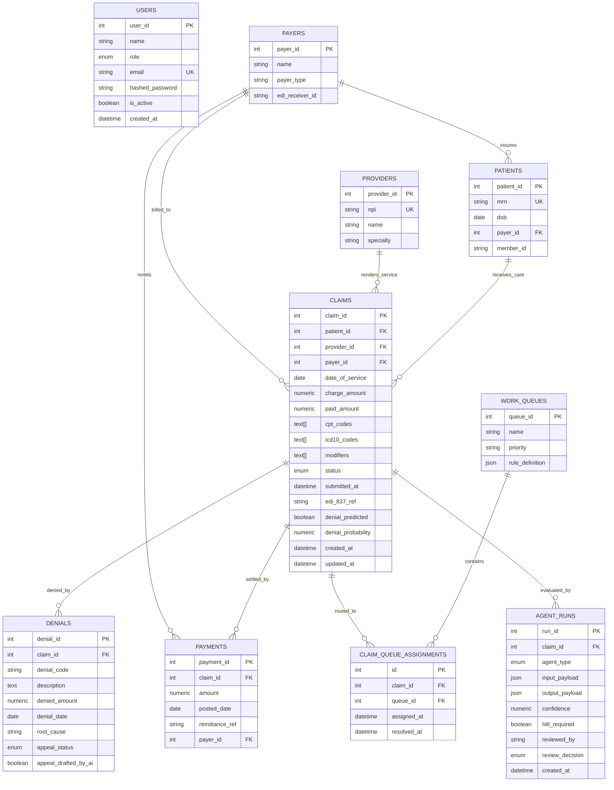

# NovaArc RCM — System Architecture, Domain Guide & Project Context

> **Target Audience**: AI Agents (resuming after context window truncation or compaction), Systems Engineers, Healthcare RCM Specialists, and Full-Stack Developers.
> **Last Updated**: September 2026
> **Repository Root**: `b:\Baskar\nova arc`
> **Status**: Production Live & Fully Synchronized

---

## 1. Executive Overview

**NovaArc RCM** is an enterprise-grade, agentic AI Revenue Cycle Management (RCM) platform built for healthcare organizations, hospitals, and medical billing agencies. It combines end-to-end medical claims lifecycle automation with specialized healthcare Large Language Models (LLMs) and Machine Learning (ML) models to accelerate reimbursement, reduce claim denials, automate clinical appeal drafting, and provide conversational financial intelligence.

### Live Production Environments

| Component | Platform | Live Production URL | Notes |
|---|---|---|---|
| **Backend API** | Render | `https://novaarc-backend.onrender.com` | FastAPI, PostgreSQL, OpenRouter, Healthcheck at `/health` |
| **Frontend Web App** | Netlify | `https://novaarc-rcm-app.netlify.app` | Vite + React SPA, continuous deployment |
| **Frontend Mirror** | GitHub Pages | `https://krishna-caare.github.io/novaarc-rcm/` | Base path `/novaarc-rcm/`, automated 404 SPA routing |

### Default Demo Credentials

All test accounts share the password `password123`:

| Email | Role | Accessible Features |
|---|---|---|
| `ops_manager@novaarc.local` | Operations Manager | Full administrative access: Dashboard, Claims, Work Queues, Denials, Payments, Agents, Assistant, Users |
| `client_leadership@novaarc.local` | Client Leadership | Executive oversight: High-level financial KPIs, aging metrics, payer comparison, analytics assistant |
| `ar_executive@novaarc.local` | AR Executive | Operational workbench: Claim editing, denial resolution, appeal drafting, payment posting, work queues |

---

## 2. Healthcare RCM Domain Guide & Claim Lifecycle

To understand the codebase, an agent must understand how healthcare billing operates in the United States under HIPAA guidelines:



### Core Domain Terminology

1. **CPT (Current Procedural Terminology)**: 5-digit numeric codes representing medical services and procedures rendered by healthcare providers (e.g., `99213` = Outpatient visit low/moderate 20-29 min, `99214` = 30-39 min, `93000` = Electrocardiogram routine ECG).
2. **ICD-10-CM (International Classification of Diseases, 10th Revision, Clinical Modification)**: Alphanumeric diagnostic codes (e.g., `I10` = Essential hypertension, `E11.9` = Type 2 diabetes without complications, `M54.5` = Low back pain).
3. **Modifiers**: 2-character alphanumeric suffixes appended to CPT codes indicating special circumstances (e.g., Modifier `25` = Significant, separately identifiable evaluation and management service on the same day as a procedure).
4. **EDI 837P**: Electronic Data Interchange ANSI ASC X12 standard for professional healthcare claims submitted to clearinghouses or payers.
5. **EDI 835**: Electronic Remittance Advice (ERA) sent by payers detailing claim payment, contract allowances, deductibles, copays, and denial reason codes.
6. **CARC (Claim Adjustment Reason Codes)**: Standardized codes explaining why a claim was adjusted or denied:
   - `CO-16`: Claim/service lacks information or has submission/billing error(s).
   - `CO-45`: Charge exceeds fee schedule / maximum allowable amount.
   - `CO-50`: Non-covered service / not deemed medically necessary.
   - `CO-18`: Duplicate claim/service.
   - `CO-97`: The benefit for this service is included in the payment/allowance for another service.
7. **AR (Accounts Receivable) Aging**: Uncollected claims grouped by age from date of service:
   - Current (0-30 days)
   - 31-60 days
   - 61-90 days
   - 90+ days (High risk of uncollectibility and timely filing expiry)
8. **Collection Rate**: `(Total Paid Amount / Total Charged Amount) * 100`. Healthy benchmark is >90-95%.
9. **Days in AR**: Average number of days from date of service to receipt of reimbursement. Healthy benchmark is <35-40 days.

---

## 3. Technology Stack

### Backend Stack
- **Framework**: FastAPI (Python 3.11) with ASGI async support.
- **ORM / Database**: SQLAlchemy 2.0 (asyncio extension), asyncpg driver, PostgreSQL (Neon / Render Managed Postgres).
- **Validation / Serialization**: Pydantic v2 schemas (`ConfigDict(from_attributes=True)`).
- **Authentication**: JWT (JSON Web Tokens) with PBKDF2 / Bcrypt password hashing and role-based dependency injection.
- **PDF Extraction**: `pypdf>=4.0.0` for parsing clinical encounter notes and superbills.
- **Data Science / ML**: `scikit-learn`, `pandas`, `numpy`, `xgboost`, `shap` (for denial risk prediction and explainability).
- **External AI Integration**: OpenRouter API (`https://openrouter.ai/api/v1`) using:
  - Primary Clinical Model: `inclusionai/ling-3.0-flash-sante:free` (Specialized healthcare/medical LLM).
  - Secondary / Analytical Model: `nvidia/nemotron-3.5-lightning:free` and `poolside/laguna-s-2.1:free`.
  - Deterministic clinical fallback engines when API keys or models are unreachable.

### Frontend Stack
- **Framework**: React 18 with TypeScript.
- **Build Tool**: Vite 5 (supports proxying in development and multi-target base paths).
- **Routing**: React Router v6 (`BrowserRouter`).
- **Icons**: Lucide React.
- **Styling**: Vanilla CSS design tokens + TailwindCSS utility classes.
- **HTTP Client**: Axios with automatic JWT request injection and 401 redirect interceptors.

---

## 4. Complete Project Directory Structure

```
nova arc/
├── backend/
│   ├── app/
│   │   ├── core/
│   │   │   ├── auth.py             # JWT token creation, password hashing, user dependencies (require_role)
│   │   │   ├── config.py           # Pydantic BaseSettings (DATABASE_URL, OPENROUTER_API_KEY, JWT secrets)
│   │   │   └── database.py         # Async engine, sessionmaker, Base model, init_db schema initialization
│   │   ├── models/
│   │   │   └── __init__.py         # SQLAlchemy ORM models: User, Patient, Provider, Payer, Claim, Denial,
│   │   │                           # Payment, WorkQueue, ClaimQueueAssignment, AgentRun
│   │   ├── routers/
│   │   │   ├── agents.py           # AI endpoints: /coding-assist, /denial-predict, /review, /pending-reviews, /runs
│   │   │   ├── assistant.py        # Conversational NL-to-SQL & RCM analytics engine: /assistant/query
│   │   │   ├── auth.py             # Auth endpoints: /register, /login, /me, /users, /roles
│   │   │   ├── claims.py           # Claims CRUD: /claims, /{id}, /submit, /extract-document, /stats/summary, /reference-data
│   │   │   ├── dashboard.py        # Analytics: /revenue-health, /ar-health, /payer-performance, /denial-intelligence
│   │   │   ├── denials.py          # Denials CRUD: /denials, /{id}, /top-codes, /{id}/draft-appeal
│   │   │   ├── payments.py         # Payments CRUD: /payments, /{id}, /stats/summary
│   │   │   └── work_queues.py      # Triage queues: /work-queues, /{id}, /{id}/claims, /{id}/claims/{cid}/resolve
│   │   ├── schemas/
│   │   │   └── __init__.py         # Pydantic v2 DTOs for all requests and responses
│   │   ├── services/
│   │   │   ├── agent_logger.py     # Logs agent execution in agent_runs table; handles HITL review status
│   │   │   ├── appeal_agent.py     # Drafts clinical appeal letters citing CMS/ERISA/LCD guidelines
│   │   │   ├── coding_agent.py     # Ling 3.0 Flash Santé medical coding extraction + heuristic fallbacks
│   │   │   ├── denial_predictor.py # ML classifier (RandomForest/XGBoost) computing denial probabilities & risk factors
│   │   │   ├── edi_parser.py       # HIPAA EDI 837P claim generator and EDI 835 remittance parser
│   │   │   └── work_queue.py       # Automated claim assignment logic into 7 specialized triage queues
│   │   └── main.py                 # FastAPI application factory, CORS configuration, exception handlers, /health
│   ├── Dockerfile                  # Container build specification for Render / cloud deployment
│   └── requirements.txt            # Python dependencies (FastAPI, SQLAlchemy, pypdf, reportlab, etc.)
│
├── frontend/
│   ├── public/                     # Static assets, favicon, 404.html for GitHub Pages SPA routing
│   ├── src/
│   │   ├── components/
│   │   │   ├── ui/
│   │   │   │   ├── Badge.tsx       # Status and priority badges with consistent color tokens
│   │   │   │   ├── Button.tsx      # Reusable button component with variant and loading states
│   │   │   │   ├── Card.tsx        # Container card with header, body, and shadow options
│   │   │   │   └── Modal.tsx       # Modal dialog supporting sm, md, lg, xl, 2xl, 3xl, 4xl, 5xl sizes
│   │   │   ├── DashboardComponents.tsx # Reusable KPI cards, aging charts, and trend widgets
│   │   │   └── Layout.tsx          # App shell (Sidebar, Header, Profile menu) and styled LoginPage
│   │   ├── context/
│   │   │   └── AuthContext.tsx     # React context managing JWT, logged-in User, login(), logout(), hasRole()
│   │   ├── lib/
│   │   │   └── utils.ts            # Formatting helpers: formatCurrency, formatPercent, formatNumber, badge styling
│   │   ├── pages/
│   │   │   ├── AgentsPage.tsx      # Interactive 4-step AI Workbench (Intake, Predictive Scrubbing, Appeals, HITL)
│   │   │   ├── AssistantPage.tsx   # Conversational natural language RCM query interface with quick prompt chips
│   │   │   ├── ClaimsPage.tsx      # Claims registry with 4XL creation modal, PDF intake, and real-time scrubbing
│   │   │   ├── DashboardPage.tsx   # Financial overview, AR aging breakdown, payer performance, denial trends
│   │   │   ├── DenialsPage.tsx     # Denials table, root cause breakdown, and one-click AI appeal letter generator
│   │   │   ├── PaymentsPage.tsx    # Cash posting, ERA remittance tracking, payment creation modal
│   │   │   ├── UsersPage.tsx       # Administrative user and role management
│   │   │   └── WorkQueuesPage.tsx  # Compact 7-queue priority operational triage board
│   │   ├── services/
│   │   │   └── api.ts              # Strongly-typed Axios ApiClient mapping all backend endpoints
│   │   ├── types/
│   │   │   └── index.ts            # TypeScript interfaces mirroring backend Pydantic models
│   │   ├── App.tsx                 # React Router configuration with ProtectedRoute and PublicRoute guards
│   │   ├── index.css               # Global typography, color variables, custom scrollbars, layout styling
│   │   └── main.tsx                # ReactDOM root initialization wrapped with BrowserRouter & AuthProvider
│   ├── index.html                  # HTML entry point with Google Fonts (Inter)
│   ├── package.json                # Frontend dependencies and npm scripts
│   ├── tsconfig.json               # TypeScript compiler configuration
│   └── vite.config.ts              # Vite config with proxying to backend and base path resolution
│
├── .github/workflows/              # GitHub Actions CI/CD workflows for automated deployment to GitHub Pages
├── netlify.toml                    # Netlify deployment rules, build command, and SPA rewrite redirects
├── render.yaml                     # Render infrastructure-as-code for FastAPI web service and Postgres DB
├── test_ai_models.py               # Standalone test script validating OpenRouter medical LLMs
├── test_features.py                # Unit test script testing feature endpoints
├── test_full_demo_verification.py  # 16-step end-to-end integration test suite verifying live production
└── test_production_e2e.py          # Production E2E verification script
```

---

## 5. Core Features & Business Logic (Pin-to-Pin)

### 1. Claims Management & PDF AI Intake
- **4XL Claim Creation Modal**: Upgraded in [Modal.tsx](file:///b:/Baskar/nova%20arc/frontend/src/components/ui/Modal.tsx) and [ClaimsPage.tsx](file:///b:/Baskar/nova%20arc/frontend/src/pages/ClaimsPage.tsx) to provide a spacious two-column workspace:
  - Left Column: Clinical document upload (PDF/TXT/MD), drag-and-drop file ingestion, automatic text extraction, and AI code suggestions.
  - Right Column: Patient, provider, payer selection, date of service, charge amount, interactive CPT/ICD-10 code pills, and a real-time rule-based claim scrubber.
- **Document Text Extraction Endpoint (`POST /claims/extract-document`)**:
  - Uses `pypdf` to extract raw clinical text from uploaded encounter notes or superbills.
  - Passes extracted text to `suggest_codes()` in [coding_agent.py](file:///b:/Baskar/nova%20arc/backend/app/services/coding_agent.py).
  - Automatically recommends primary ICD-10 diagnoses, CPT procedure codes, and estimates charges against an outpatient fee schedule.
- **EDI 837P Submission (`POST /claims/{id}/submit`)**:
  - Validates that claim is in `created` status.
  - Generates HIPAA-compliant ANSI ASC X12 837P text via [edi_parser.py](file:///b:/Baskar/nova%20arc/backend/app/services/edi_parser.py).
  - Stamps `submitted_at` timestamp and assigns unique `edi_837_ref`.
  - Automatically routes claim into operational work queue.

### 2. Multi-Entity State Synchronization
The backend enforces relational integrity across claims, denials, payments, and work queues:
- Setting claim status to `denied` via `PATCH /claims/{id}` automatically generates a corresponding `Denial` record (`CO-16` / Missing Information) and assigns the claim to the *Denials - Work* queue.
- Setting claim status to `paid` via `PATCH /claims/{id}` automatically posts a matching `Payment` record with an auto-generated ERA reference.
- Setting denial appeal status to `won` via `PATCH /denials/{id}` automatically transitions the parent claim to `paid` ($250.00) and updates collection metrics.
- Setting denial appeal status to `submitted` transitions the parent claim to `appealed`.

### 3. Work Queues & Priority Routing
Operational claims are automatically assigned to one of 7 distinct queues in [work_queue.py](file:///b:/Baskar/nova%20arc/backend/app/services/work_queue.py):
1. **Appeals - Drafting**: Denied claims with appeal status `not_started` or `drafted`.
2. **Appeals - Follow-up**: Denied claims with appeal status `submitted`.
3. **High Risk - Denial Prevention**: Claims where ML model predicted denial probability > 0.70.
4. **Denials - Work**: Unresolved denied claims.
5. **Aging - 60+ Days**: Unpaid claims older than 60 days.
6. **Aging - 30-60 Days**: Unpaid claims between 30 and 60 days.
7. **New Claims - Review**: Newly created claims needing initial billing review.

### 4. AI Agents & Human-In-The-Loop (HITL)
- **Medical Coding Specialist**: Powered by `inclusionai/ling-3.0-flash-sante:free`. Extracts diagnoses and procedures from clinical narrative, calculates overall confidence, and identifies documentation gaps.
- **Denial Risk Classifier**: Random Forest / XGBoost model predicting denial probability from 10 clinical and operational features. Produces SHAP feature importance explanations and human-readable risk factors.
- **Clinical Appeal Drafter**: Powered by Ling 3.0 / Nemotron. Drafts formal appeal letters citing CMS National Coverage Determinations (NCD), Local Coverage Determinations (LCD), and ERISA regulations.
- **HITL Review Workflow**: If agent confidence falls below 75% or high financial risk is detected, `hitl_required` is set to `True`. Logged in `agent_runs` table. Supervisors can approve, reject, or edit outputs at `POST /agents/review`.

### 5. Conversational AI Assistant (NL-to-SQL)
Located at `POST /assistant/query` in [assistant.py](file:///b:/Baskar/nova%20arc/backend/app/routers/assistant.py):
- Deterministic Intent Matcher handles common RCM queries: `ar_over_90`, `denial_rate`, `top_denial_codes`, `payer_comparison`, `collection_rate`, `total_ar`, `claims_by_status`.
- Natural Language to SQL Engine: For arbitrary analytical questions, prompts OpenRouter models (`poolside/laguna-s-2.1:free`, `nvidia/nemotron-3.5-lightning:free`) with the Postgres schema, extracts read-only `SELECT` queries, executes them safely, and formats the output with contextual follow-up recommendations.

---

## 6. Database Schema & Entity Relationships



---

## 7. Recent System Updates & Changelog

1. **4XL Modal Expansion**:
   - Replaced cramped default modal with 56rem/64rem wide 2-column interface in [Modal.tsx](file:///b:/Baskar/nova%20arc/frontend/src/components/ui/Modal.tsx) and [ClaimsPage.tsx](file:///b:/Baskar/nova%20arc/frontend/src/pages/ClaimsPage.tsx).
   - Solved cursor loss bug by removing re-mounting focus traps on number inputs.
2. **Clinical Document Parsing & Intake**:
   - Integrated `pypdf>=4.0.0` inside `POST /claims/extract-document`.
   - Enabled instant ingestion of outpatient encounter PDFs with real-time CPT/ICD-10 extraction and fee estimation.
3. **Multi-Entity Claim Synchronization**:
   - Added automatic synchronization so marking a claim as `denied` or `paid` creates corresponding records in `denials` or `payments` tables and updates operational work queues.
   - Dual-registered `@router.patch` and `@router.put` across `/claims/{id}` and `/denials/{id}`.
4. **Payer Performance NaN Guarding**:
   - Hardened [dashboard.py](file:///b:/Baskar/nova%20arc/backend/app/routers/dashboard.py), [DashboardComponents.tsx](file:///b:/Baskar/nova%20arc/frontend/src/components/DashboardComponents.tsx), and [utils.ts](file:///b:/Baskar/nova%20arc/frontend/src/lib/utils.ts) to calculate `collection_rate` safely and prevent `toFixed` crashes on undefined values.
5. **Work Queues Compact Visual Overhaul**:
   - Consolidated 7 vertical cards into a high-density operational table (~46px per row) in [WorkQueuesPage.tsx](file:///b:/Baskar/nova%20arc/frontend/src/pages/WorkQueuesPage.tsx).
6. **Production Verification Suite**:
   - Created [test_full_demo_verification.py](file:///b:/Baskar/nova%20arc/test_full_demo_verification.py) verifying all 16 critical workflows against live Render and Netlify deployments.
